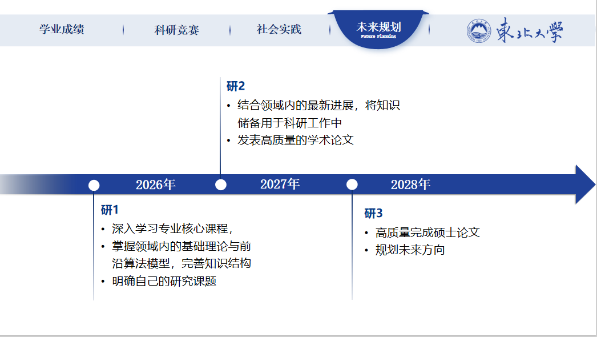

<!-- 两个徽标 -->

#### 教育背景
东北大学  | 计算机科学与技术 | 2026届 
GPA  4.265/5.0 | 绩点排名 8/191 
主修课程：C++程序设计（97）、线性代数（99）、概率论与数理统计（100）、离散数学（100）、数据结构（96）、编译原理（97）、电子技术基础（100）、汇编语言程序设计（99）、计算机组成原理（100）、软件工程（98）、数据库原理（98）、计算机网络（96）、人工智能导论（98）
#### 科研经历

##### 1.基于EfficientNet和ViT的深度伪造图像检测研究
<b>项目地址</b>：https://github.com/ForIt111/Deepfake-Image-Detection 
<b>项目简介</b>：针对AI生成的深度伪造（Deepfake）图像检测问题，基于深度学习方法，构建了基于Efficientnet和ViT的模型。
 
<b>负责工作与成果</b>：负责模型的设计与优化，提出Efficientnet和ViT结合的创新架构，优化训练策略，提升模型性能。负责编写EfficientNet模型作为局部特征提取器，利用其在图像分类任务中的高效性能捕捉图像的局部细节信息，编写特征转换模块，将EfficientNet提取的特征图转换为适合ViT处理的图像块嵌入。负责编写Vision Transformer模型，对全局特征进行建模，通过自注意力机制捕捉图像中的长距离依赖关系。两种网络架构的有效融合显著提升了模型判别力，模型检测准确率达96.6%。项目获得全球校园人工智能算法大赛国家三等奖。 
<b>个人工作</b>：负责模型的设计与优化 
<b>项目成果展示</b>： 

  

##### 2.基于AHP、SVM和神经网络的网球比赛势头预测研究
<b>项目地址</b>：https://github.com/ForIt111/Tennis-Momentum-Prediction 
<b>项目简介</b>：针对网球比赛势头预测问题，基于机器学习方法，构建了一种基于AHP、SVM和神经网络的预测方法。 
<b>项目实现</b>：负责模型设计与论文的撰写工作，针对子问题搭建模型，优化模型性能，详细撰写了模型的实现成果和创新点。负责设计层次分析法（AHP）量化关键指标权重，设计支持向量机（SVM）分类势头状态，并负责编写神经网络预测势头趋势。AHP提供了可解释性指标权重，SVM验证了势头变化的非随机性，准确度达到93.3%，神经网络则捕捉了时序依赖关系，R2值达到0.953，预测性能优秀，项目获得国际大学生数学建模竞赛国家二等奖。 
<b>个人工作</b>：负责模型设计与论文的撰写工作 
<b>项目展示</b>：
 

  

#### 荣誉奖项
校综合一等奖学金 2次（前1.5%） 
校综合三等奖学金 3次 
校三好学生 
全国大学生数学建模竞赛国家级二等奖 
蓝桥杯全国软件和信息技术专业人才大赛省级三等奖 
全球校园人工智能算法大赛国家三等奖 (2024.11) 
睿抗机器人开发者大赛（编程技能赛）国家级三等奖 (2024.08) 
“让世界了解长城”高校英语视频演讲大赛市级三等奖 (2024.06) 

#### 个人介绍

 

  

#### 荣誉证书
<!-- 奖学金、比赛、荣誉称号、社会工作、 -->
<!-- 奖学金 -->
奖学金证书 

<!-- 比赛 -->
比赛获奖证书 

<!-- 荣誉称号 -->
荣誉称号证书 

